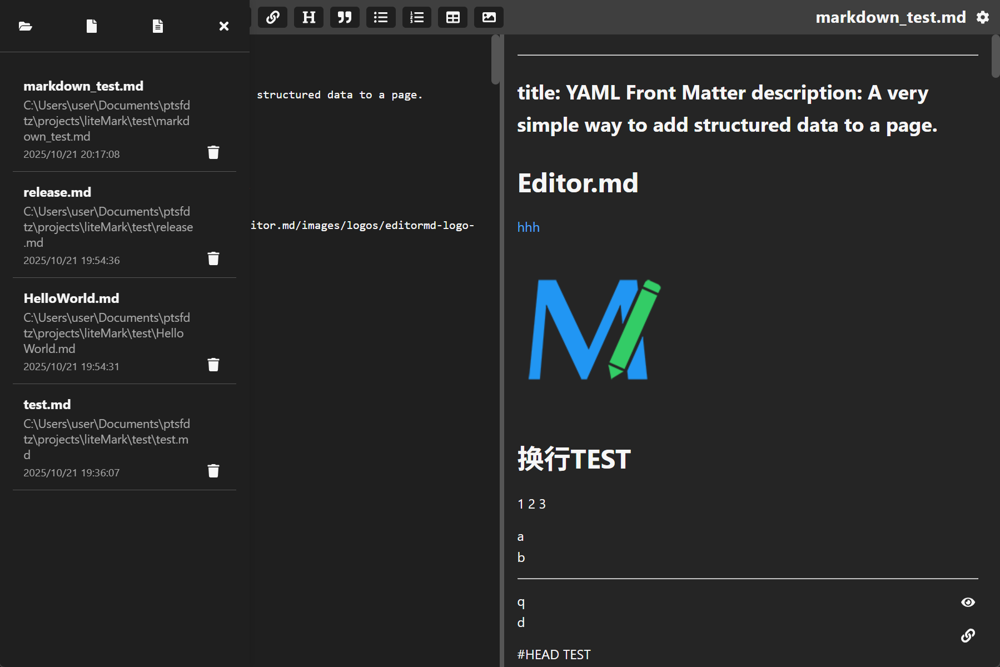
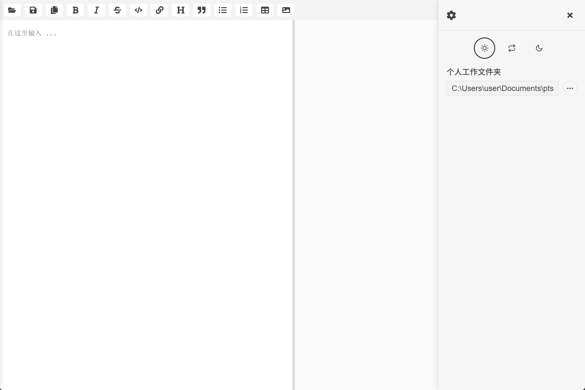

# 🪶 LiteMark

> ✍️ **LiteMark** is a **lightweight**, **fast**, and **modern Markdown editor** built with **Tauri** — less memory, more focus, no Electron bloat.

<p align="center">
  
</p>

---

## 🌙 Themes

LiteMark supports both **light** and **dark** themes.

|                   Cadmium Light                  |                       Dark                      |
| :----------------------------------------------: | :---------------------------------------------: |
|  |  |

---

## ✨ Features

* ⚡ **Lightweight & Fast** — Tauri-based, minimal memory usage
* 🧘 **Minimal UI** — distraction-free writing
* 🪶 **Live Preview** — instant Markdown rendering
* 💾 **Auto Save** — never lose your drafts
* 🌙 **Dark / Light Mode** — follows system theme
* 🧩 **Cross-platform** — Windows, macOS, Linux

---

## ❓ Why LiteMark?

* **Electron is too heavy** — Tauri enables small, fast desktop apps
* **Other editors feel bloated** — great tools, but not built for pure writing
* **Built with passion** — a personal project focused on simplicity and craft

---

## 🚀 Installation

### Prebuilt

👉 **[Download from Releases](https://github.com/ptsfdtz/litemark/releases)**

### Build from source

```bash
git clone https://github.com/ptsfdtz/litemark.git
cd litemark
pnpm install
pnpm tauri dev
pnpm tauri build
```

---

## 🧩 Tech Stack

| Layer    | Tech                                |
| -------- | ----------------------------------- |
| Runtime  | Tauri                               |
| Frontend | React + TypeScript                  |
| Styling  | CSS Modules                         |
| Markdown | remark / rehype / remark-gfm / math |

---

## 🤝 Contributing

Issues and PRs are always welcome —
bug reports, feature ideas, docs, or code improvements ❤️

---

## 🧑‍💻 Author

**Haoran Tong (ptsfdtz)**
GitHub: [https://github.com/ptsfdtz](https://github.com/ptsfdtz)

---

⭐ **Like LiteMark? Star the repo to support the project!**
📖 **[🇨🇳 中文说明](./README.zh-CN.md)**